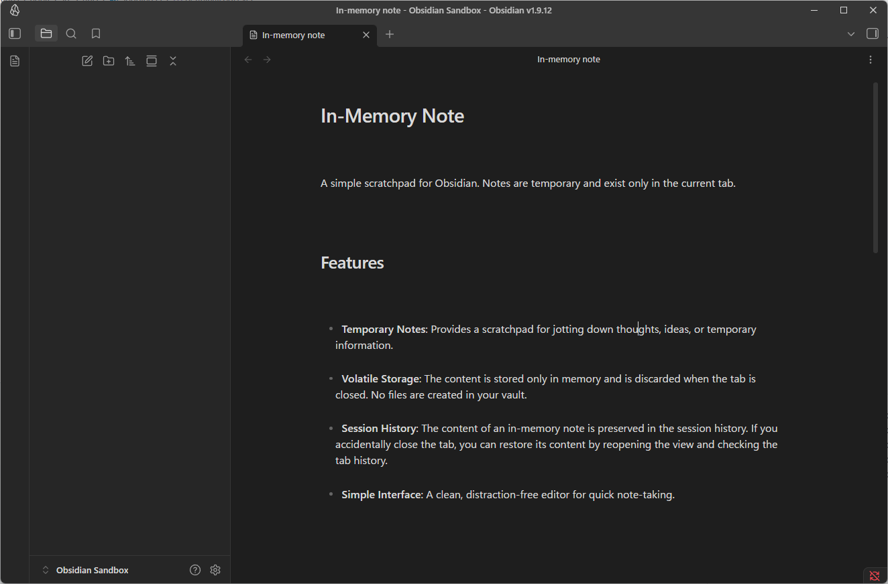

# Sandbox Note for Obsidian

A simple, temporary spot for your quick thoughts.

This plugin gives you two special notes: "Sandbox Note" and "In-Memory Note." Write anything you want here; it's **not** saved as a file in your vault. It's a clean space for messy notes without clutter.

> **Important**: All Sandbox Note tabs share the same content. If you open multiple Sandbox Note tabs, they'll show the same text and update together. In-Memory Notes are separate for each tab and disappear when closed.

## How It Works

*   **No Files Created**: Write freely without making new `.md` files.
*   **Familiar Editor**: Works like Obsidian's own editor. Markdown, links, and commands are mostly supported.
*   **Safe for Your Session**: Your Sandbox Note content stays safe as long as Obsidian is open. Close a tab by accident? Just open a new one to get your text back. In-Memory Notes, however, are gone when you close their tab.

## How to Use

*   Click the ribbon icon to open a new **Sandbox Note**.
*   Click the other ribbon icon to open a new **In-Memory Note**.
*   Or, use the Command Palette (`Ctrl/Cmd+P`) and search for "Open sandbox note" or "Open in-memory note."
*   You can now save your Sandbox Note manually with `Ctrl+S` (or `Cmd+S`).

---

## ⚠️ Risks and Limitations

This plugin uses some of Obsidian's internal tools to work. Please know:

*   **Obsidian updates might break it.** We'll try to fix issues, but can't promise it will always work.
*   **Use at your own risk.**

We want you to understand how it works.

---

## Optional: Auto-Save for Sandbox Note

You can turn on an "auto-save" option in the plugin settings.

*   **What it does**: Your Sandbox Note content saves itself in the plugin's settings (`data.json`). This happens when you switch tabs or close the note.
*   **Why use it?**: Your Sandbox Note content will be there even after you restart Obsidian.
*   **Still no `.md` files**: This feature still does **not** create any `.md` files in your vault.

## Installation

1.  Open Obsidian's **Settings**.
2.  Go to **Community plugins** and turn off **Restricted mode**.
3.  Click **Browse** to find community plugins.
4.  Search for "**Sandbox Note**".
5.  Click **Install**, then **Enable**.

## Acknowledgements

The idea for this plugin was partly inspired by the [obsidian-lineage](https://github.com/ycnmhd/obsidian-lineage) plugin by ycnmhd.
